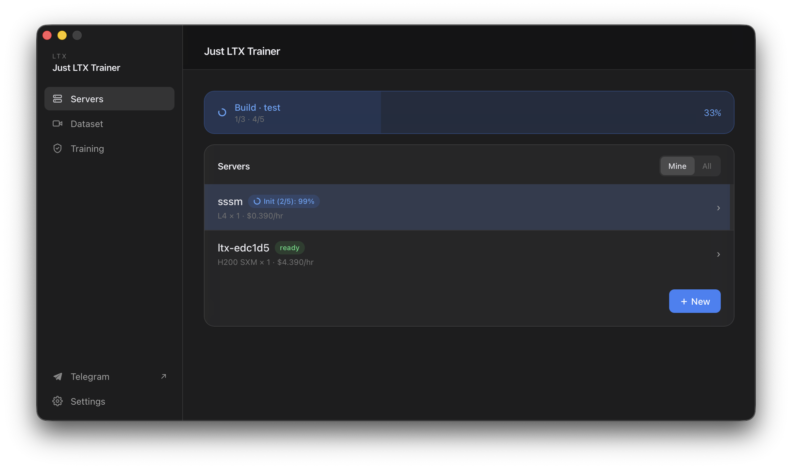
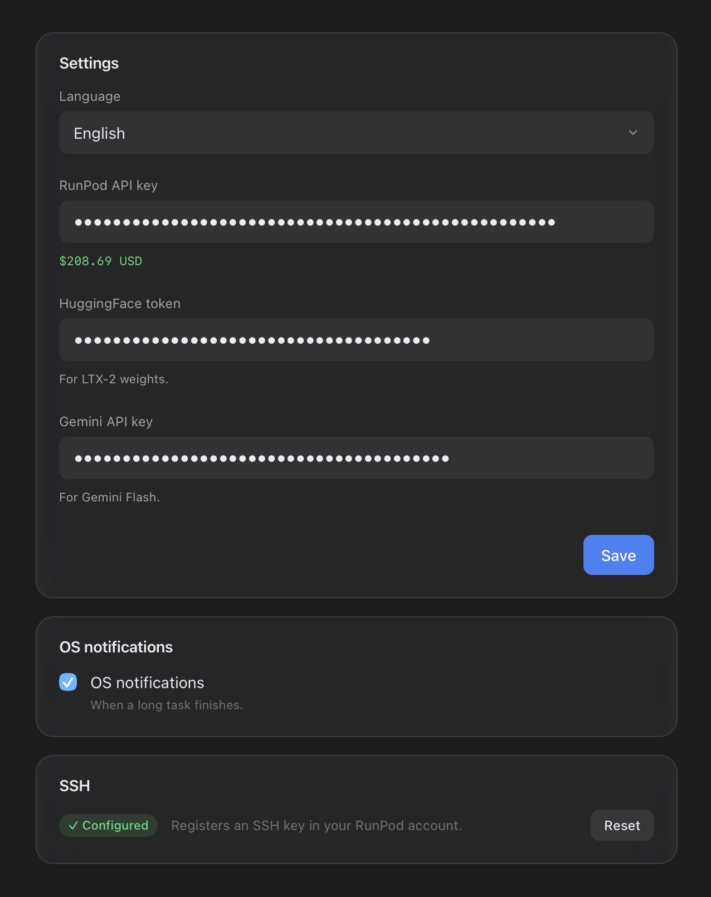
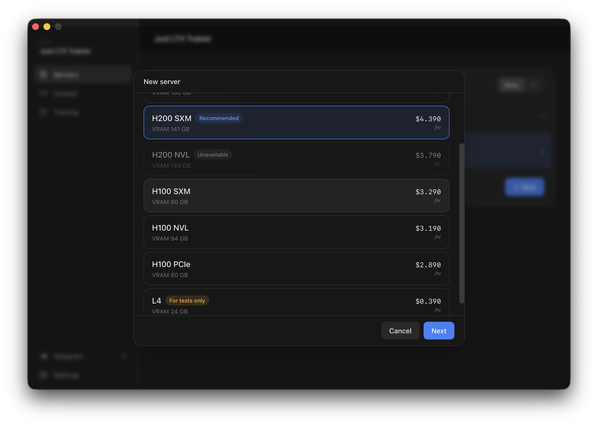
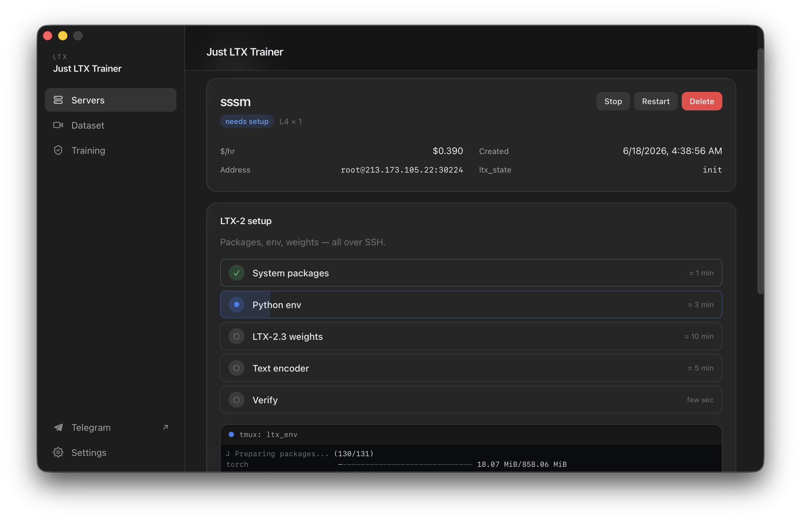
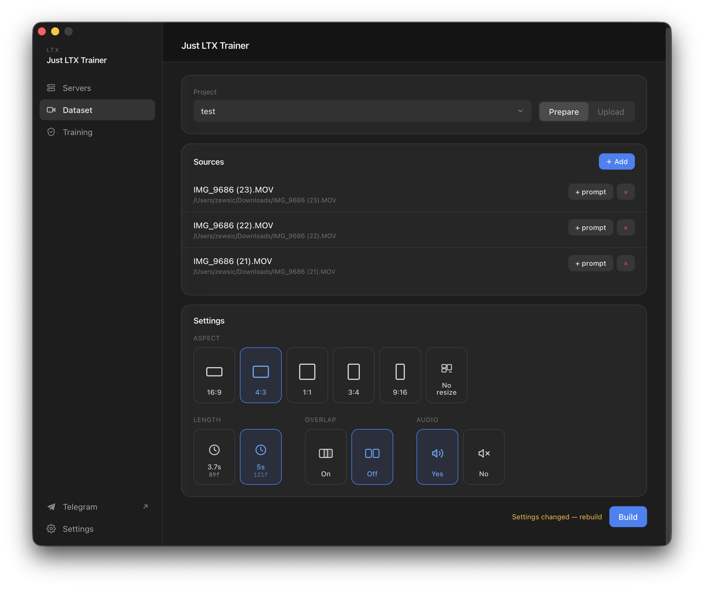
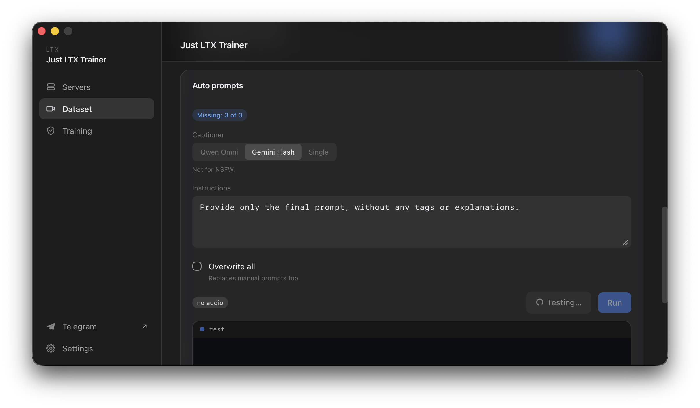
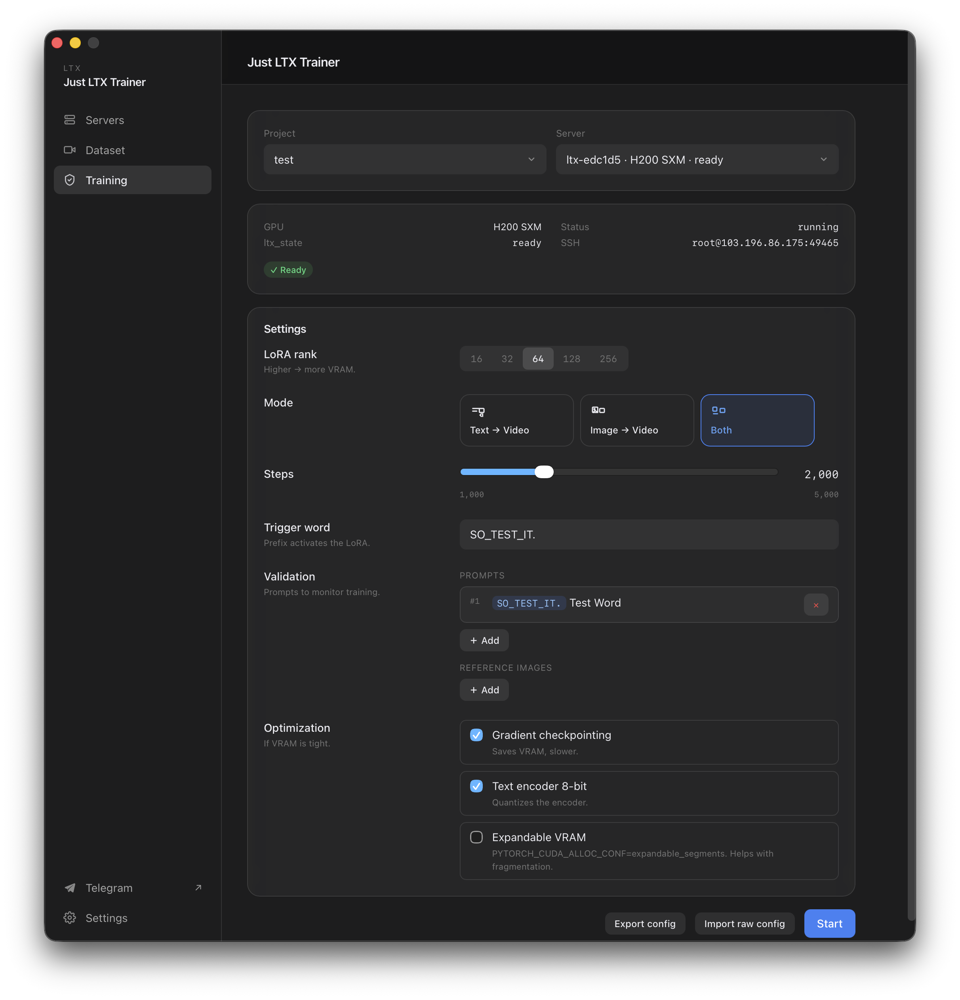
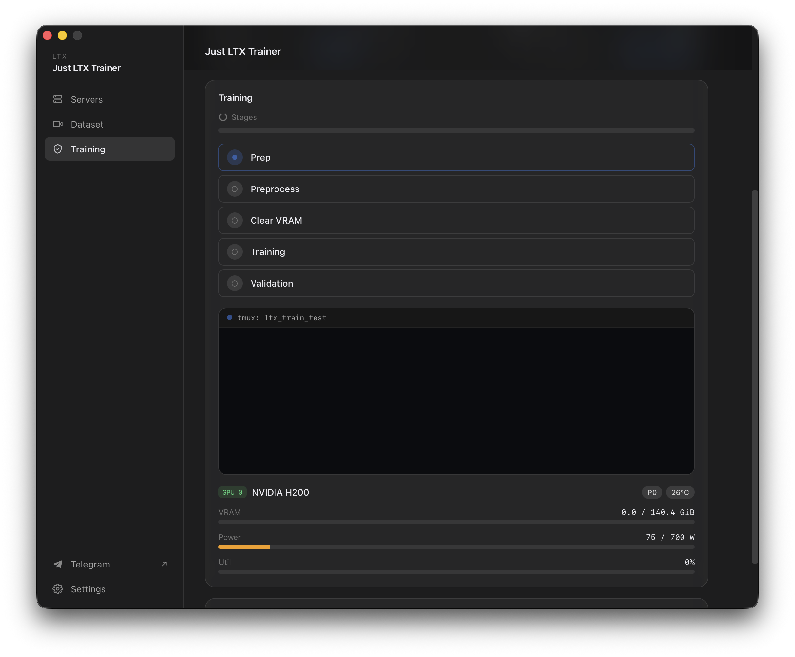
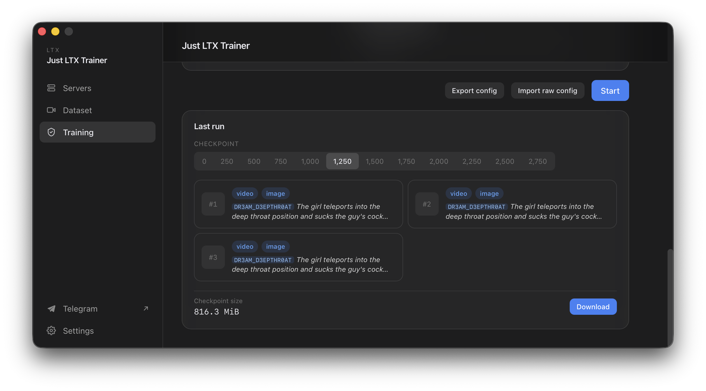

# Just LTX Trainer

[](https://github.com/zewsic/just-ltx-trainer/actions/workflows/ci.yml)
[](https://github.com/zewsic/just-ltx-trainer/actions/workflows/release.yml)
[](LICENSE)

Train a **LoRA on LTX 2.3** without touching a terminal. A desktop app that drives a rented RunPod GPU for you: drop in your videos, click through five screens, and walk away. Comes back with samples you can preview right in the window.

> If you've trained image LoRAs before but every video-LoRA tutorial sends you into a 12-tab rabbit hole of SSH, tmux, Python envs, and YAML — this is the shortcut.

<!-- SCREENSHOT: hero / main window -->


---

## What you'll need

- A **RunPod account** with some credit on it ([runpod.io](https://runpod.io)).
- A **HuggingFace token** (free) so the app can pull LTX 2.3 weights — [huggingface.co/settings/tokens](https://huggingface.co/settings/tokens).
- **20–80 short video clips** you want the LoRA to learn from. Anything from 3 seconds and up. Vertical, horizontal, mixed — all fine.
- Optional: a **Gemini API key** if you want Google to write the prompts for your clips.

That's it. No CUDA install, no Python, no `pip`. Everything heavy runs on the rented pod.

---

## The five-screen tour

The whole app is built around five tabs you walk through in order. Once a screen turns green you move to the next.

### 1. Settings — connect your accounts

<!-- SCREENSHOT: settings -->


Open Settings first. Paste:

- **RunPod API key** — the app uses it to spin up GPU pods.
- **HuggingFace token** — for downloading LTX 2.3 the first time you set up a pod.
- **Gemini API key** (optional) — only if you want Gemini Flash to caption clips.
- **SSH** — click "Set up" once. The app generates a key, registers it in your RunPod account, and uses it for all future pods. You won't see SSH again after this.

### 2. Servers — rent a GPU

<!-- SCREENSHOT: servers list + create flow -->


Hit "+ New", pick a GPU. The "Recommended" tag points to a card that handles LTX 2.3 well; "For tests only" Don't use "For Testing Only" cards.

After you create it, the pod card runs through a **5-step setup** automatically (packages → Python env → LTX 2.3 weights → text encoder → verify). Takes 15–25 minutes the first time. You can close the app and come back — the setup keeps going on the pod.



When the card says **Ready** you're done here.

### 3. Dataset → Prepare — cut your clips

<!-- SCREENSHOT: dataset prep tab -->


Drag your source videos into the window. For each one you can write a quick description of what's happening (or leave it blank and let the captioner do it later).

Then pick:

- **Aspect ratio** — five standard sizes, or **No resize** to keep every clip at its native resolution and fps. No-resize is the right answer when your clips are already cleaned up and you don't want the app re-encoding them.
- **Length** — 3.7 s or 5 s per clip. The number shown under each tile is how many frames that becomes.
- **Overlap** — split each source video into half-overlapping clips. Doubles your sample count from the same footage.
- **Audio** — include audio in training (LTX 2.3 supports it).

Click **Build**. The app cuts every source into fixed-length clips with ffmpeg and zips them up. A green card appears when it's done.

### 4. Dataset → Upload — push to the pod

Pick the pod you set up in step 2. Click **Upload**. Goes over `runpodctl` with a live progress bar. The card turns green when the pod has your data.

#### Captions (optional, on the same screen)

If you didn't write descriptions in step 3, this is where you fix that. Pick a captioner:

- **Qwen Omni** — runs on the pod itself. Free, slower, good with NSFW.
- **Gemini Flash** — Google API. Faster, won't touch NSFW.
- **Single** — type **one prompt**, click Apply, every clip gets that same caption. Useful for style LoRAs where every clip is the same subject.

Hit **Test** first to see what the model writes for one clip. Hit **Run** to caption everything.



### 5. Training — train the LoRA

<!-- SCREENSHOT: training settings -->


The settings here are picked for you based on your GPU and clip count — usually you just hit **Start**. If you want to tweak:

- **LoRA rank** — bigger = more capacity, more VRAM. Default scales with clip count.
- **Mode** — `t2v` (prompt only), `i2v` (start from a reference image), `both`.
- **Steps** — how long to train. Slider goes 1000–5000.
- **Trigger word** — a prefix that activates your LoRA at inference. E.g. `mystyle`, then prompts like *"mystyle. a cat on a roof"* invoke it.
- **Validation** — prompts (and reference images for i2v) that get rendered every 250 steps so you can watch the LoRA learn.
- **VRAM optimization** — three checkboxes for gradient checkpointing / 8-bit text encoder / expandable VRAM. Turn them on if you OOM.

**Export / Import raw config.** Hit "Export config" to dump the exact YAML being sent to the trainer. Edit anything you want, then "Import raw config" to send your version as-is on the next run.

Click **Start**. Then go make coffee — small LoRAs take ~30 min, bigger ones a few hours.

<!-- SCREENSHOT: active training run with live log -->


While it's running you see live loss / step time / ETA, plus a checkpoint list as each one lands.

### 6. Validation viewer — watch it learn

<!-- SCREENSHOT: validation viewer -->


Click any checkpoint to see the sample videos rendered at that step, next to the prompt (and reference image, for i2v). Use it to pick the checkpoint where the LoRA looks best — usually before it overfits.

### 7. Download the LoRA

From the same validation panel, **Download** opens a one-step flow: the pod sends the checkpoint over `runpodctl`, you can either save it to your local Downloads folder or copy a transfer code and grab it from another machine.

---

## Tips

- **Close the app whenever.** Every long task — setup, build, upload, captioning, training — runs in `tmux` on the pod. Reopen the app later and it picks up exactly where you left off.
- **Stop the pod when you're not using it.** RunPod charges per hour even when idle. The Servers tab has Stop / Start buttons.
- **First run is slow.** Initial pod setup downloads ~30 GB of LTX 2.3 weights. Subsequent pods on the same account reuse the cache.
- **OOM on training?** Turn on gradient checkpointing and 8-bit text encoder before lowering the rank.
- **Mixed resolutions.** With No resize on, the trainer learns from all your aspect ratios at once — handy when your source footage isn't uniform.
- **Batch training.** You can train multiples loras on same time on different pods.

---

## Install

Grab a build from [Releases](https://github.com/zewsic/just-ltx-trainer/releases).

- **macOS** — universal `.dmg`. Unsigned, so on first launch:
  ```sh
  xattr -dr com.apple.quarantine "/Applications/Just LTX Trainer.app"
  ```
  Or right-click → Open.
- **Windows** — `.msi` (x64). SmartScreen → "More info" → "Run anyway".
- **Linux** — `.AppImage` (`chmod +x` then run) or `.deb` (`sudo apt install ./just-ltx-trainer_*.deb`). Needs `libwebkit2gtk-4.1`.

### Build from source

```sh
pnpm install
pnpm tauri dev          # dev mode
pnpm tauri build        # production build
```

Requirements: Node 20+, pnpm 9+, Rust stable. On macOS: Xcode CLT. On Windows: WebView2 + MSVC build tools. On Linux: `libwebkit2gtk-4.1-dev`, `librsvg2-dev`, `libgtk-3-dev`, `libsoup-3.0-dev`, `patchelf`.

---

## License

[MIT](LICENSE). LTX 2.3 itself is governed by its own [model license](https://github.com/Lightricks/LTX-2).
